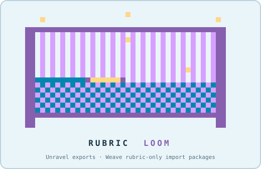

# Rubric Loom

<p align="center">
  
</p>

Rubric Loom is a guided local tool for people who need to inspect, revise, or
move Brightspace rubrics without hand-editing D2L XML. It runs on your
computer and opens through one of two doors:

| Door | Bring | Take away |
| --- | --- | --- |
| **Unravel** | A Brightspace course-export ZIP, an unpacked export folder, or a bare `rubrics_d2l.xml` | A review workbook, structured rubric JSON, and a reviewer DOCX |
| **Weave** | A completed rubric in a supported DOCX table, Markdown table, or JSON format | Producer preflight followed by a validated, rubric-only Brightspace import package and its review/receipt companions |

After choosing Unravel, you can read one export or select **Bulk Unravel** and
point the Loom to a parent folder. Bulk Unravel inventories the folder's
immediate course-export ZIPs and unpacked export folders, reviews the batch
once, and gives every course its own output folder and run log.

Rubric Loom has no AI component. It is deterministic, rules-based Python
software that reads and writes against known Brightspace/D2L package
structures. Processing stays on your computer, and the Loom does not change
Brightspace: you review every output, import a Weave package yourself, and
attach imported rubrics to activities manually.

## Start here

**On macOS:** clone or download this repository, then double-click
`launch_rubric_loom.command`. The launcher checks for Python 3.11–3.13 and,
on the first run, offers to create a local `.venv` inside this folder. It
then opens the Loom artwork and the two choices directly: **Unravel** or
**Weave**.

**From a terminal:** use any installed Python 3.11, 3.12, or 3.13:

```bash
python3.13 scripts/bootstrap_env.py
.venv/bin/python scripts/rubric_loom_wizard.py
```

Substitute `python3.11` or `python3.12` when that is the supported Python on
your machine.

The terminal guide chooses sensible file and folder names after it reads your
source. Before anything is written, one review card shows the source, exact
filenames, save folder, and relevant review options. Press Return to use the
recommendations, or enter the number of the one item you want to change.
Bulk Unravel shows one inventory and destination review before running each
export in sequence; one failed or rubric-free export does not conceal the
remaining results. Weave also shows its producer preflight and requires the
final named approval `WEAVE`.

Environment checks are automatic and quiet when everything is ready. If a
required Python package is missing, the Loom explains what it needs and
offers to install the pinned dependencies into its local `.venv`. The full
diagnostic checklist remains available with
`.venv/bin/python scripts/rubric_loom_wizard.py --doctor`.

The guided TUI also checks GitHub for a newer published Rubric Loom release
at most once per day. Current, offline, and failed checks stay quiet. When a
newer release exists, the Loom shows the installed and available versions and
can open the release page; it never installs an update automatically. Use
`--check-for-updates` for an explicit check or `--no-update-check` to skip the
automatic check.

Want to look around before using your own files? Each door’s source chooser
includes a synthetic demonstration. The examples contain no course, learner,
or institutional data.

For detailed terminal and headless options, see
[`docs/RUBRIC_LOOM_WIZARD.md`](docs/RUBRIC_LOOM_WIZARD.md).

## Technical overview

This repository is the portable producer for **Rubric Loom**: one rubric
service with two doors that converge on the Brightspace rubric dialect
(`rubrics_d2l.xml`, schemaversion v2011).

- **Unravel**: a Brightspace course export, an unpacked export
  folder, or a bare `rubrics_d2l.xml` becomes a review workbook, a
  `coursecraft.rubrics/1` JSON document validated against the vendored
  schema, and a reviewer DOCX. One command:

  ```bash
  .venv/bin/python scripts/run_rubric_bundle.py path/to/export.zip
  ```

  Attribute values and authored wording are preserved verbatim; nothing is
  inferred. Add `--progress-events` to stream `coursecraft.progress/1`
  NDJSON for wizard-style consumers. The guided TUI's Bulk Unravel option
  coordinates this same command once per immediate ZIP or unpacked export
  folder; it does not add a second extraction implementation.

- **Weave**: the pinned Workbench producer accepts supported DOCX rubric
  tables, Markdown tables, `coursecraft.rubric_authoring/1` JSON, eligible
  `coursecraft.rubrics/1`, and the documented legacy JSON shape. The strict
  bundle orchestrator preflights, builds, validates, and receipts a
  rubric-only import package:

  ```bash
  .venv/bin/python scripts/run_weave_bundle.py rubric.md --preflight
  .venv/bin/python scripts/run_weave_bundle.py rubric.md \
    --output-dir output/example__weave_bundle
  ```

  Missing scoring or weights refuse unless their explicit approval flags are
  supplied. Nothing is imported, and activity attachment remains manual.
  Interactive and headless terminal builds bind the package to the exact
  source SHA-256 and byte count shown by preflight.

Two Workbench-owned `v1` intake templates are shipped as exact release-pinned
assets:

```bash
.venv/bin/python scripts/rubric_loom_wizard.py \
  --door weave --list-templates --plain
.venv/bin/python scripts/rubric_loom_wizard.py \
  --door weave \
  --copy-template rubric-weave-intake-template.md \
  --template-destination path/to/my-rubric.md \
  --plain
```

Listing and selecting never write. Copying requires an explicit destination;
an existing regular file requires the separate `--replace-template` action,
and symlink or non-regular destinations are refused. Complete and save the
copy, select it in Weave, review producer preflight, correct missing scoring
or explicitly approve only a permitted fallback, then type `WEAVE`. Downloading
or completing a template changes nothing in Brightspace. A successful build is
not an import, attachment remains manual, and scoring is never silently
invented.

## Ownership

`coursecraft_workbench` remains the upstream owner of rubric contracts,
extraction and build semantics, and live-import evidence. This repo contains
byte-pinned downstream copies of the portable producer files; the pin and
every promoted file digest are recorded in `upstream/workbench_pin.json`.
The current mechanical distribution ref is Workbench
`ad08b1ca1ebd0889bba3353cd87ca71b88f26514`; its producer files retain the
accepted semantics at
`7c5140545548c89a254ac4502cfdd7ee6fb44255`.
The rubric extraction scripts also ship inside `brightspace-blueprint-bundle`
as part of full blueprint runs; both downstream copies trace to the same
Workbench source, and fixes land upstream first.

Bundle-only code (the orchestrators, synthetic journey, release and
environment mechanics, and terminal Rubric Loom) may be authored here. It
must not silently fork upstream semantics.

## Install and run the synthetic proof

```bash
python3.13 scripts/bootstrap_env.py --dev
.venv/bin/python scripts/run_synthetic_journey.py
```

The journey weaves an import package from a synthetic fixture contract,
validates it, unravels it back through extraction, and asserts the rubric
names survive the loop. The receipt lands in
`output/synthetic_journey/journey_receipt.json`. See
`docs/SYNTHETIC_JOURNEY.md`.

## The terminal wizard (two doors)

```bash
.venv/bin/python scripts/rubric_loom_wizard.py
```

Or double-click `launch_rubric_loom.command` (macOS). On a fresh machine it
offers to build the `.venv`, then opens the Loom artwork and the explicit
**Unravel** / **Weave** landing page. Each door offers its own synthetic
demonstration from the source chooser.

Unravel retains its export peek and review artifacts, and offers single or
bulk processing after the door is selected. Weave invokes producer preflight,
shows only producer-reported labels and scoring evidence, requires a named
final approval, and leads with the receipt-grounded import ZIP.
Both doors share automatic environment checks, the terminal kit,
progress-event consumer, cancellation behavior, plain mode, launcher, and
door-isolated remembered state. The verbose doctor is an explicit diagnostic
command, not a normal journey screen. Legacy `--source PATH --yes` remains
Unravel. Headless Weave requires
`--door weave --source PATH --yes --approve-weave`. See
`docs/RUBRIC_LOOM_WIZARD.md`.

## Verify the source boundary

```bash
.venv/bin/python scripts/vendor_from_workbench.py --check
.venv/bin/python scripts/vendor_from_workbench.py --compare-ref main --workbench ../coursecraft_workbench
```

Promotion happens only after the named Workbench ref has passed its upstream
review and tests:

```bash
.venv/bin/python scripts/vendor_from_workbench.py --update-pin --workbench ../coursecraft_workbench --ref <reviewed-commit>
```

## Build a release asset

```bash
.venv/bin/python scripts/make_release_asset.py --ref <tag-or-commit>
```

The builder exports one explicit ref (clean tree required; `--allow-dirty`
builds the named ref anyway), stages:

- `RELEASE_MANIFEST.json` (`coursecraft.bundle_release/1`) with source,
  contract and runtime digests plus independent Unravel and Weave capability
  records;
- deterministic `SBOM.json` (`coursecraft.bundle_sbom/1`) from
  `requirements-lock.txt`, including exact template asset records.

It writes a reproducible `dist/brightspace-rubric-bundle-v<VERSION>.tar.gz`
and matching `.sha256` sidecar. The version is read from `VERSION` at that
ref. Unravel and Weave have separate runtime-marker gates; a missing Weave
producer, pin, TUI, preflight, progress, receipt, or manual-attachment marker
prevents the release build. Missing or mismatched template manifest/assets
also prevent construction; the archive contains the exact bytes named by the
Weave capability and SBOM.

## Current surface

| Piece | Status |
| --- | --- |
| `scripts/run_rubric_bundle.py` (Unravel orchestrator) | Working; emits `coursecraft.progress/1` on request |
| `scripts/make_release_asset.py` (release machinery) | Working; immutable v1.2.0 remains published from `6c1af0a…`; deterministic v1.2.1 provenance repair is published from `ee61bbf…` with archive SHA-256 `8b739638…` |
| Pinned producer, schemas, fixtures, and templates | 36 byte-identical Workbench files at `ad08b1c…`; accepted producer semantics remain `7c51405…` |
| `scripts/run_weave_bundle.py` (Weave orchestrator) | Working; strict preflight, exact source-byte binding, six progress steps, validated outputs, and a final receipt whose bundle commit comes from the exact repository root or immutable release manifest—never an ambient parent checkout |
| `scripts/run_synthetic_journey.py` | Working proof with a written receipt |
| Terminal Rubric Wizard | Working two-door surface; integrity-gated template list/copy, producer preflight, named Weave approval, exact source snapshot, receipt-grounded results, plain/headless mode, one macOS launcher |
| Hosted workshop bench | Authorized next consumer; see `ROADMAP.md` R4 |

The ownership decision record is `docs/REPOSITORY_BOUNDARY.md`. The phased
plan is `ROADMAP.md`. Agent rules are `AGENTS.md`.
